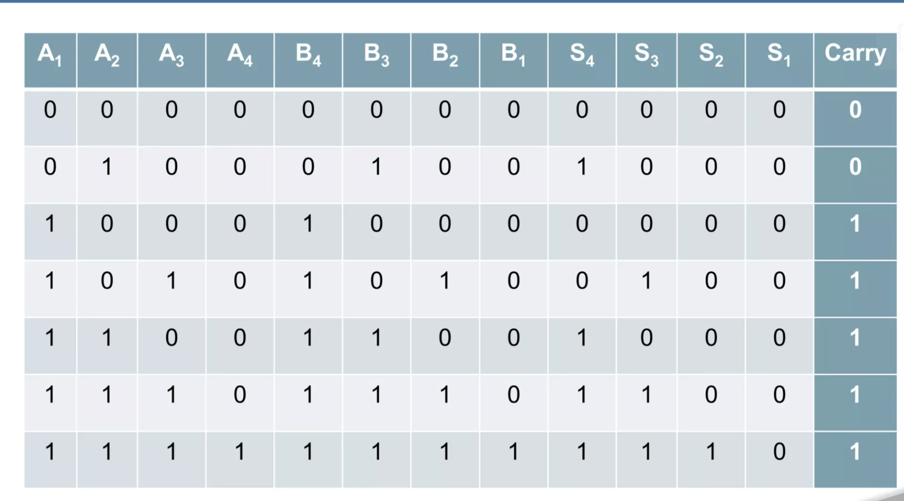
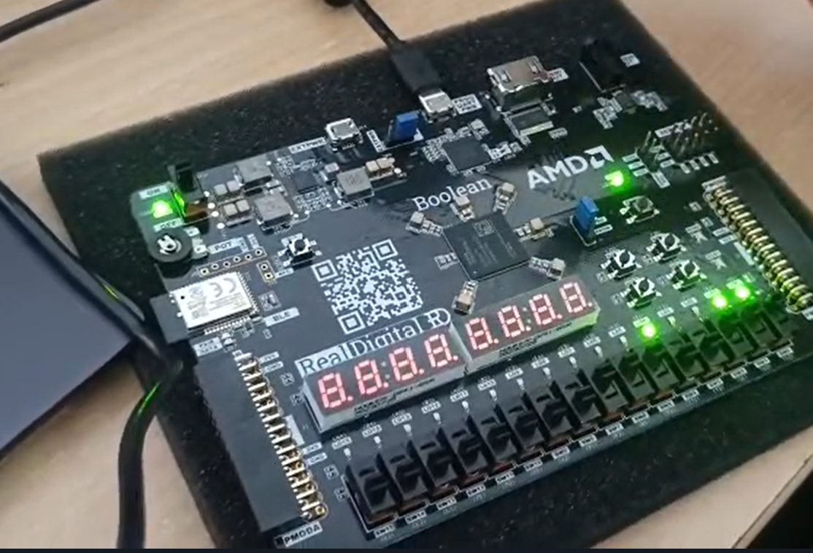
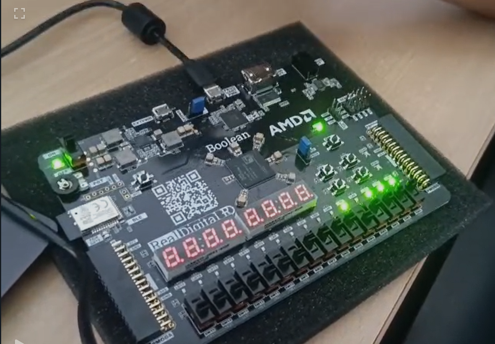

# Ripple-Carry-Adder-vs-Carry-Look-Ahead-Adder
Certainly! Based on the contents of your repository, here's a comprehensive `README.md` file tailored for your project:

---

```markdown
# Ripple-Carry Adder vs Carry Look-Ahead Adder

This repository presents a comparative study between two fundamental digital adder architectures: the **Ripple-Carry Adder (RCA)** and the **Carry Look-Ahead Adder (CLA)**. Implemented in Verilog HDL, the project includes simulation testbenches and visual outputs to illustrate the performance differences between these adders.

## 📁 Repository Structure

```
.
├── cla_adder.v             # Verilog code for the 4-bit Carry Look-Ahead Adder
├── rca_adder.v             # Verilog code for the 4-bit Ripple-Carry Adder
├── testbench.v             # Testbench for simulating both adders
├── 4 bit carry look ahead adder.pdf  # Documentation detailing CLA design
├── rca.png                 # Image illustrating the RCA structure
├── fpga 2.png              # FPGA implementation image
├── fpga board.png          # Image of the FPGA board used
└── README.md               # Project documentation
```

## 🧠 Project Overview

In digital electronics, adders are crucial components for arithmetic operations. This project focuses on:

- **Ripple-Carry Adder (RCA):** A straightforward design where each bit's carry-out becomes the next bit's carry-in, resulting in linear propagation delay.
- **Carry Look-Ahead Adder (CLA):** An optimized design that computes carry signals in advance, significantly reducing propagation delay.

By implementing both adders and analyzing their performance, this project highlights the trade-offs between simplicity and speed in adder designs.

## 🚀 Getting Started

### Prerequisites

To simulate and test the Verilog codes, ensure you have the following tools installed:

- **Verilog Simulator:** [Icarus Verilog](http://iverilog.icarus.com/) or [ModelSim](https://www.intel.com/content/www/us/en/software/programmable/quartus-prime/model-sim.html)
- **Waveform Viewer (Optional):** [GTKWave](http://gtkwave.sourceforge.net/)

### Simulation Steps

1. **Clone the Repository:**

   ```bash
   git clone https://github.com/pathrossse/Ripple-Carry-Adder-vs-Carry-Look-Ahead-Adder.git
   cd Ripple-Carry-Adder-vs-Carry-Look-Ahead-Adder
   ```

2. **Compile the Verilog Files:**

   ```bash
   iverilog -o adder_sim cla_adder.v rca_adder.v testbench.v
   ```

3. **Run the Simulation:**

   ```bash
   vvp adder_sim
   ```

4. **View the Waveform (Optional):**

   If your testbench generates a `.vcd` file:

   ```bash
   gtkwave dump.vcd
   ```

## 📊 Performance Comparison

| Feature               | Ripple-Carry Adder (RCA) | Carry Look-Ahead Adder (CLA) |
|-----------------------|--------------------------|-------------------------------|
| **Propagation Delay** | Linear (Slower)          | Logarithmic (Faster)          |
| **Hardware Complexity** | Low                    | High                          |
| **Scalability**       | Less Efficient for Large Bit-widths | More Efficient for Large Bit-widths |
| **Design Simplicity** | Simple                   | Complex                       |

The CLA offers faster computation by reducing the carry propagation delay, making it more suitable for high-speed arithmetic operations in processors and digital systems.

## 📷 Visual Aids

- **RCA Structure:** 
- **FPGA Implementation:** 
- **FPGA Board Used:** 

## 📄 Documentation

For an in-depth understanding of the Carry Look-Ahead Adder design, refer to the provided PDF document:

- [4 bit carry look ahead adder.pdf](4%20bit%20carry%20look%20ahead%20adder.pdf)

## 🧑‍💻 Author

**Pathrose Sebastian**

- GitHub: [pathrossse](https://github.com/pathrossse)

Feel free to reach out for any queries or discussions related to this project.

## 📜 License

This project is licensed under the [MIT License](LICENSE).

---

```

---

Feel free to customize this `README.md` further to include specific simulation results, additional images, or links to related projects. If you need assistance with any other aspect of your project, don't hesitate to ask! 
